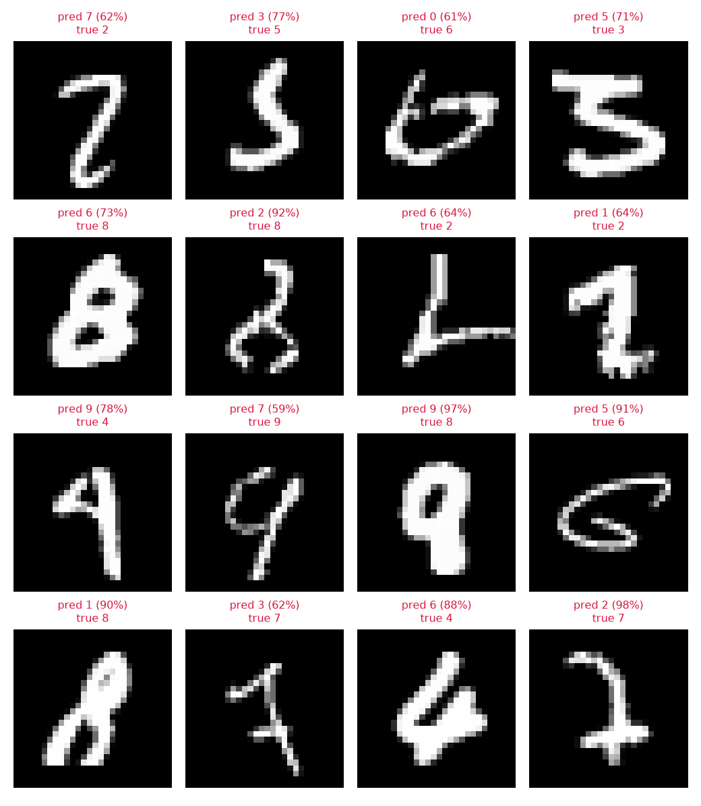

# Digit Guesser

A small convolutional network that reads handwritten digits, plus a drawing pad so
you can test it with your own handwriting instead of just trusting the accuracy
number.

Training takes under a minute. Then you draw a digit with your mouse and it guesses,
and you can see the 28x28 image it actually gets.



```
epoch 3: train loss 0.0405 | test loss 0.0287 | test acc 99.11%
```

Everything is plain PyTorch. No pretrained weights, the network is about 40 lines and
trains from scratch on MNIST.

## Quick start

You need Python 3.11 or newer. A GPU helps but is not required.

```bash
python -m venv .venv
.venv\Scripts\Activate.ps1        # Windows
# source .venv/bin/activate       # macOS / Linux

# for GPU, get the right command for your CUDA version at pytorch.org/get-started/locally
pip install torch torchvision --index-url https://download.pytorch.org/whl/cu130
# CPU only:
# pip install torch torchvision

pip install -r requirements.txt
```

Then:

```bash
python src/data.py                  # downloads MNIST, about 11 MB, one time
python src/train.py --epochs 3      # ~30s on a laptop GPU, a few minutes on CPU
python src/draw.py                  # the drawing pad
```

## The drawing pad

`draw.py` opens a canvas. Draw a digit and it predicts as you go.

| | |
|---|---|
| left mouse | draw |
| right mouse | erase |
| `C` | clear |
| `M` | switch how your drawing gets centred |
| `Esc` | quit |

The middle panel shows the 28x28 that the model actually sees, which is worth
watching. Most of the time a weird prediction makes sense once you look at what went
in. On the right are the curves from your last training run: loss for train and test,
and test accuracy per epoch.

You can also check the model against the real test set:

```bash
python src/predict.py --mistakes    # writes predictions.png of what it got wrong
```

Most of the errors that are left are digits that a person would hesitate on too.

## Why your own handwriting is harder

The model gets 99% on MNIST but does noticeably worse on the pad. That gap turned out
to be the most interesting part of this project, and it is not the network's fault.

MNIST digits were never raw scans. Every one of them went through a pipeline: crop to
the digit's bounding box, scale so the longest side is 20px, then place it in a 28x28
field positioned by **centre of mass**, not by the centre of the bounding box.

That last step is the one everybody skips. A `1` carries its weight off to one side, a
`7` is top heavy. If you centre those by bounding box they end up somewhere the model
has never seen a digit before, and accuracy drops a lot.

`src/digit_prep.py` does the real pipeline, and the `M` key turns the centre of mass
step off so you can watch the predictions get worse in real time.

The takeaway goes well past MNIST: if a model works on the benchmark and fails on your
own data, check the preprocessing before you blame the architecture.

## How the network works

If you do not know much about convolutional networks, I took notes while building this
one. [Notes_CNN.pdf](Notes_CNN.pdf) covers kernels, padding, pooling and where the
shapes come from, starting from nothing.

```
input                    1 x 28 x 28
conv1 -> relu -> pool   32 x 14 x 14     32 kernels, each 3x3
conv2 -> relu -> pool   64 x  7 x  7     64 kernels, each 3x3x32
flatten                       3136
fc1 -> relu -> dropout         128
fc2                             10       one score per digit
```

421,642 parameters. The part I did not expect: the two conv layers are only 18,816 of
those, under 5%. The dense layer that reads their output is 95% of the model.

`padding=1` keeps each conv the same width and height (28 + 2 - 3 + 1 = 28), and each
2x2 max pool halves it, which is where the `7 x 7` comes from.

## Layout

```
src/
  data.py         MNIST loaders, normalisation, device selection
  model.py        the network
  train.py        training loop and evaluation
  predict.py      renders predictions and mistakes to a PNG
  digit_prep.py   drawing to MNIST style 28x28
  draw.py         the drawing pad
tests/
  test_model.py       architecture, gradient flow, overfit one batch
  test_digit_prep.py  the preprocessing pipeline
```

```bash
pytest -q     # 15 tests
```

The one I would point at is `test_can_overfit_one_batch`. If a network cannot get the
loss to zero on eight examples it has already seen two hundred times, the bug is in the
training step, not in the data or the learning rate. It is the fastest way to tell a
broken model from a badly tuned one.

## Things to try

* **Ablate.** Remove `conv2`. Remove dropout. Swap both convs for a plain
  `nn.Linear(784, 128)`. The difference between that and the CNN is basically the whole
  argument for convolutions, in one number.
* **Augment.** Add `transforms.RandomAffine(degrees=10, translate=(0.1, 0.1))` to the
  training set and see what it does to the drawing pad.
* **Look at the kernels.** `model.conv1.weight` is a `(32, 1, 3, 3)` tensor. Plot those
  32 grids as images. They start random and end up as edge and blob detectors without
  anyone telling them to.
* **Watch it overfit.** Run `--epochs 20` and find the point where test loss starts
  going up while train loss keeps going down.

## Notes

Weights get saved to `mnist_cnn.pt` on best test accuracy only, and the per epoch
numbers to `history.json`, which is what the drawing pad plots. Those two and `data/`
are gitignored, so if you clone this, `data.py` re-downloads MNIST in a few seconds.
